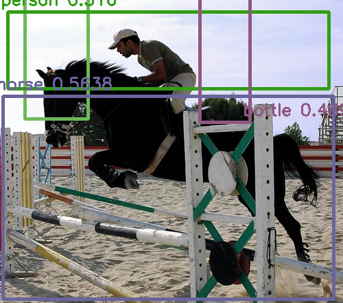
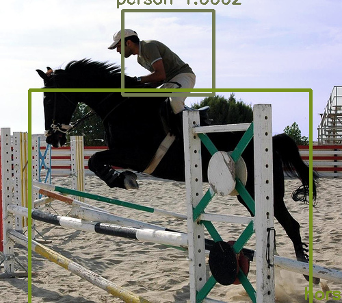
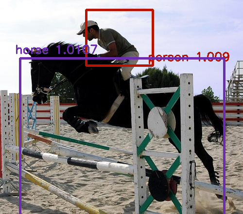
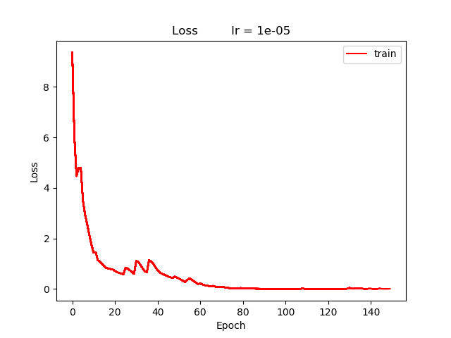
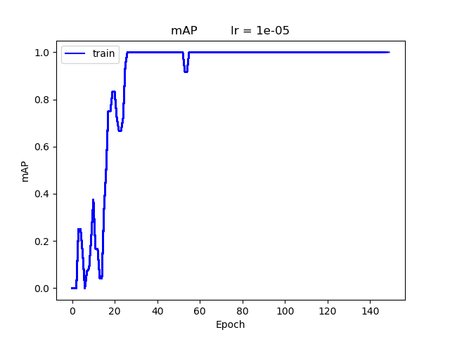

# README
This is my PyTorch implementation of 
[YOLO v1](https://pjreddie.com/media/files/papers/yolo.pdf) from scratch, which includes scripts for **train/val** and **test**. 

It not only helps me gain learning experience of using PyTorch, but also serves as a framework for
 One-Stage Detector facilitates future development.
 Please See [Descriptions](#description). 

This implementation pass [sanity check](#Sanity-Check). 

## Requirements
**Packages**
- Python 3.7

- CUDA 10.0

- PyTorch 1.1

- Numpy >= 1.15

- Scikit-image >= 0.14

- Matplotlib >= 2.2.3

**Hardware**
- **2 GPUs** each with at least **11 GB** RAM.

## Descriptions

**Modules**

- `utils.py` -- data format transformation and performance evaluation

- `draw.py` -- output visualization

- `dataset.py` -- dataset and dataloader

- `model.py` -- define network architecture 

- `model_parallel.py` -- build model in parallel 
(**placing 2 different sub-networks of the model onto 2 GPUs**)

- `train.py` -- calculate loss

**Scripts**

- `train_model_parallel.py` -- **train** model on VOC  

- `test_voc.py` -- **test** model on VOC

## Usage
**Warning:** Since Pytorch does not come with the `same padding` option, minor modification is required:

### Step 1: Modify `conv` module

Go to PyTorch site package folder (e.g.
`/venv/lib/python3.7/site-packages/torch/nn/modules/conv.py`).

<!--**Step 2: Add custom function**-->

Define `conv2d_same_padding` as follows.
    
    def conv2d_same_padding(input, weight, bias=None, stride=1, padding=1, dilation=1, groups=1):

        input_rows = input.size(2)
        filter_rows = weight.size(2)
        effective_filter_size_rows = (filter_rows - 1) * dilation[0] + 1
        out_rows = (input_rows + stride[0] - 1) // stride[0]
        padding_needed = max(0, (out_rows - 1) * stride[0] + effective_filter_size_rows -
                  input_rows)
        padding_rows = max(0, (out_rows - 1) * stride[0] +
                        (filter_rows - 1) * dilation[0] + 1 - input_rows)
        rows_odd = (padding_rows % 2 != 0)
        padding_cols = max(0, (out_rows - 1) * stride[0] +
                        (filter_rows - 1) * dilation[0] + 1 - input_rows)
        cols_odd = (padding_rows % 2 != 0)

        if rows_odd or cols_odd:
            input = F.pad(input, [0, int(cols_odd), 0, int(rows_odd)])

        return F.conv2d(input, weight, bias, stride,
                  padding=(padding_rows // 2, padding_cols // 2),
                  dilation=dilation, groups=groups)

<!--**Step 3: Modify `forward( )`**-->

Modify `forward` function in `class Conv2d( _ConvNd)` by replacing `F.conv2d` with `conv2d_same_padding`.

    class Conv2d( _ConvNd):

        @weak_script_method
        def forward(self, input):
            #return F.conv2d(input, self.weight, self.bias, self.stride,
            #                        self.padding, self.dilation, self.groups)
            return conv2d_same_padding(input, self.weight, self.bias, self.stride,
                        self.padding, self.dilation, self.groups) ## same padding like TensorFlow    

### Step 2: Download data
Please follow instructions **Get The Pascal VOC Data** and **Generate Label for VOC** at
 https://pjreddie.com/darknet/yolo/.
 
**Warning**: Make sure you see these in the dataset directory (e.g. folder `VOC_yolo_format`):

    2007_test.txt   VOCdevkit
    2007_train.txt  voc_label.py
    2007_val.txt    VOCtest_06-Nov-2007.tar
    2012_train.txt  VOCtrainval_06-Nov-2007.tar
    2012_val.txt    VOCtrainval_11-May-2012.tar

### Step 3: Train model

**Default settings**

    batch_size = 32
    use_float64 = False
    use_scheduler = True
    use_bn = True
    learning_rate = 1e-5
    model_weights = None
    phases = ['train', 'val']

*Note*: For sanity check, set `use_bn = False` and `phase = ['train']` instead.

**How to run?**

`$ python train_model_parallel.py -n [num_epoch] -t [train_txt]`
## Outputs
`Training log`, `plots`, `checkpoints` and **best** `weights` will be automatically saved in these folders.

                ./log
                ./plot
                ./checkpoints
                ./weights

## Experiments
### Sanity Check
Overfit the model with two samples. 

Set regularization to zero by `use_bn = False`, and use **train** mode ONLY via `phase = ['train']`.

**Default settings**
    
    num_epoch = 150
    use_float64 = False
    use_scheduler = False
    use_bn = False
    phase = ['train']
    learning_rate = 1e-5
    model_weights = None   

#### Detections

The following shows the detection output of epoch `25`, `50`, `100` and `150` respectively. 
Model converges after `100` epochs with `loss` close to `0` and `mAP` equals `1.0`.

Notes:

* By VOC convention, `IOU >=0.5` is considered as True Positive.

* Bounding boxes with `confidence_score <= 0.1` will be filtered out.
To customize, go to `utils.py`, and declare your preferred value for `conf_threshold` in `prediction2detection()`.

 *epoch = 25*
 *epoch = 50*

 *epoch = 100*
 *epoch = 150*
 *Ground Truth*

#### Loss

 

#### mAP

 

## Reference
[1] You Only Look Once: Unified, Real-Time Object Detection. https://pjreddie.com/media/files/papers/yolo.pdf

